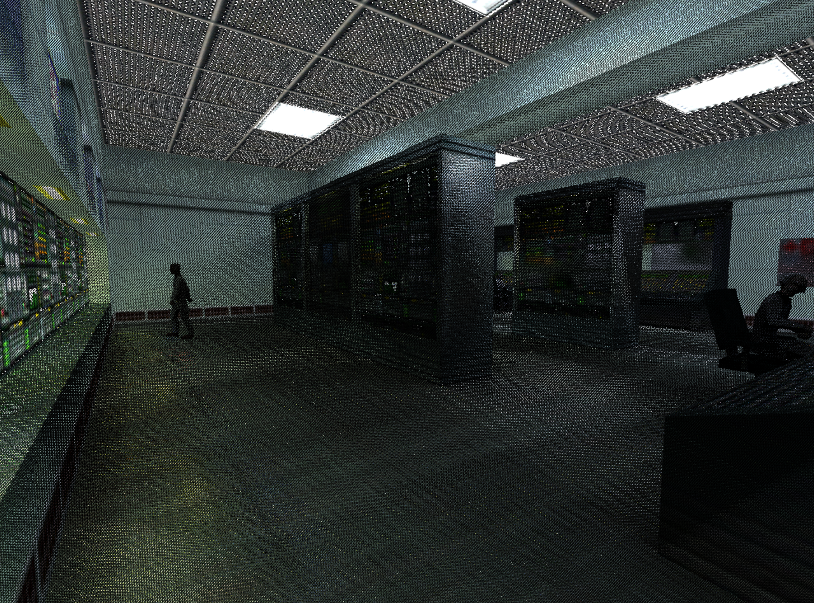
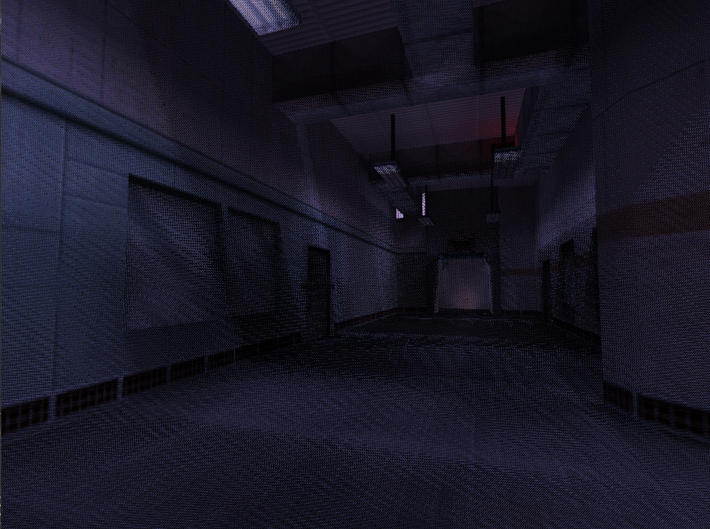

# glRemix


<table style="width:100%; table-layout:fixed; border-collapse:collapse;">
  <tr>
    <td></td>
    <td></td>
  </tr>
  <tr>
    <td></td>
    <td></td>
  </tr>
</table>


<table style="width:100%; table-layout:fixed; border-collapse:collapse;">
  <tr>
    <th style="text-align:center;">Original</th>
    <th style="text-align:center;">glRemix</th>
  </tr>
  <tr>
    <td></td>
    <td></td>
  </tr>
  <tr>
    <td></td>
    <td></td>
  </tr>
</table>


## Overview
glRemix is a DirectX 12 powered platform for remastering old OpenGL games using modern graphics such as real-time raytracing, modern lighting and asset replacement all without modding or source code access.


This is done by replacing the Window's opengl.dll in the host app’s .exe location, which causes the host app’s OpenGL API calls to be intercepted by the glRemix shim layer. These OpenGL commands are sent to the glRemix renderer via interprocess communication, where it interprets and executes them, effectively recreating scenes in real-time in DirectX 12.


## Features



The application and path-traced DXR renderer comes equipped with the following rendering features:
* **Path Tracing**
* **Direct Lighting**
* **Textures + Materials System**
* **Environment Mapping**
* **Asset Replacement**
* **PBR Overrides**


## Building


This project is set up to allow for both 32-bit and 64-bit compilation of the shim layer using CMake's ExternalProject mechanism.


1. Clone project.
2. Create build directory: 
  `mkdir build`
3. Configure project: 
  `cd build` 
  `cmake ..`
4. Build project: 
  `cmake --build . --config Release`


### Additional CMake Configuration Options


#### **`GLREMIX_BUILD_SHIM_X64` and `GLREMIX_BUILD_SHIM_WIN32`:**
By default, the 32-bit shim is built. To build the 64-bit shim instead, configure with: 
`cmake .. -DGLREMIX_BUILD_SHIM_X64=ON -DGLREMIX_BUILD_SHIM_WIN32=OFF`


#### **`GLREMIX_DEPLOY_DIR`:**
The deploy directory where DLLs and PDBs are copied after build can be configured with `-DGLREMIX_DEPLOY_DIR=<path>`. By default it is set to the project root.


#### **`GLREMIX_OVERRIDE_RENDERER_PATH` and `GLREMIX_CUSTOM_RENDERER_EXE_PATH`:**
To facilitate development, you may enable this option and set a custom path to the `glRemix_renderer.exe` file (which should have the folder `shaders` alongside it) like so:


```cmake
cmake .. -DGLREMIX_OVERRIDE_RENDERER_PATH=ON -DGLREMIX_CUSTOM_RENDERER_EXE_PATH="path\to\the\renderer\executable
```


This will override the path that the shim looks for when launching the DX12 renderer executable as a child process which can be useful for development as you no longer need to copy the renderer files to the app location. By default `GLREMIX_CUSTOM_RENDERER_EXE_PATH` will be set to where it has been deposited from CMake's deploy step, i.e. `${GLREMIX_DEPLOY_DIR}/$<CONFIG>/renderer/glRemix_renderer.exe`, where `<CONFIG>` is `Debug`, `Release`, etc.


## Minimum Requirements


* DX12 Ultimate (Feature Level 12_2)
* Raytracing Tier 1.1
* GPU Upload Heap Support
* Tier 2 Descriptor Heaps


## Dependencies


* [D3D12MemoryAllocator](https://github.com/GPUOpen-LibrariesAndSDKs/D3D12MemoryAllocator) - MIT License
* [DirectXTex](https://github.com/microsoft/DirectXTex) - MIT License
* [fastgltf](https://github.com/spnda/fastgltf) - MIT License
* [Dear ImGui](https://github.com/ocornut/imgui) - MIT License
* [SXC](https://github.com/AaronTian-stack/QhenkiX/tree/main/SXC) - MIT License


## Technical System Details
Please refer to the [System Details](docs/system-details.md) document for more technical information.


## Development Progress
Please refer to the [Development Progress](docs/system-details.md#development-progress) section in the system details document for information on the project's development progress.