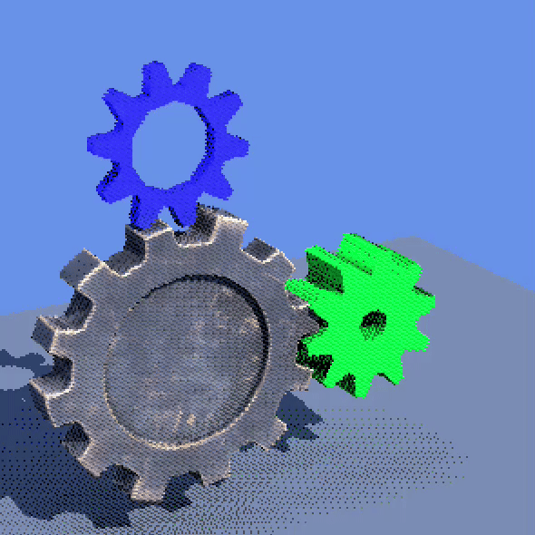
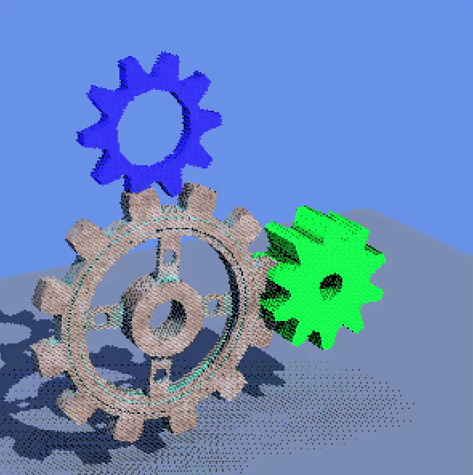
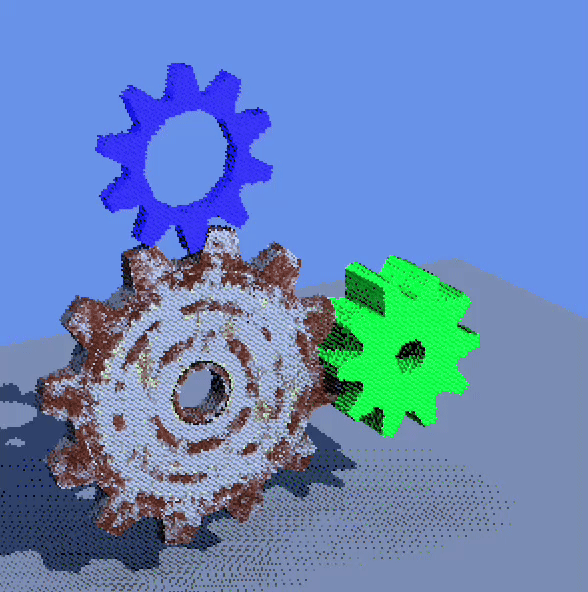
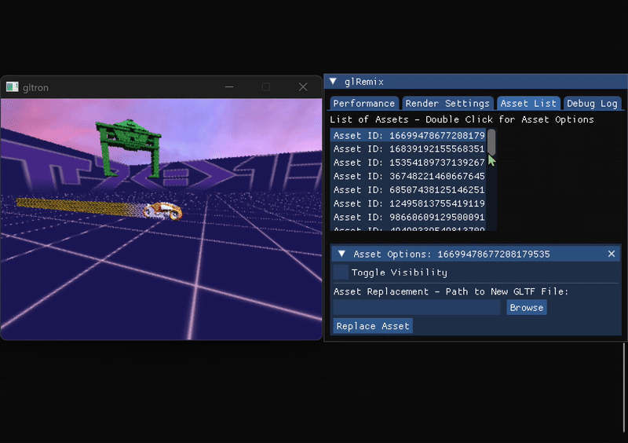

# glRemix

## Shim Layer
The `shim layer` intercepts OpenGL commands from the host application and writes them to a shared memory buffer via interprocess communication.

Please refer to the [IPC](IPC.md) and [synchronization](synchronization.md) documentation for more details on the system.

## Driver
The `glDriver` consumes frames from the IPC shared memory buffer and processes commands sequentially. Each command has a type and payload, and are dispatched to handler functions that update the `glState` which will later be interpreted by the renderer. 

glRemix currently supports the following classes of OpenGL 1.0 commands, detailed by the Khronos Group's [official documentation](https://registry.khronos.org/OpenGL/specs/gl/glspec10.pdf).

* **Immediate Mode Geometry (glBegin/glVertex/glEnd)**
* **Client Arrays (glDrawArrays/glDrawElements)**
* **Display Lists**
* **Textures**
* **Materials**
* **Lights**
* **Matrix Operations**

glRemix also currently supports the following OpenGL extensions:
* **MultitextureARB**

### The glState Object

The `glState` accumulates all OpenGL state from commands:

**Per-Frame State (cleared each frame):**
- List of mesh instances to render this frame
- Material data for each instance
- Transform matrices for each instance
- New mesh data awaiting GPU upload
- New texture data awaiting GPU upload

**Persistent State (cached across frames):**
- `Mesh Map` - Hash → MeshRecord lookup for geometry deduplication
- `Display Lists` - Compiled command buffers for display lists
- Current vertex attributes (color, normal, UV)
- Matrix stacks (modelview, projection)
- Lighting state (8 lights with position, diffuse, specular, etc.)
- Texture bindings and enabled state

### Geometry Handling
We convert immediate mode draw calls to DX12 resources by hashing geometry specified by immediate mode or client array commands. If the mesh has not been encountered before, we signal the `glState` to create resources for the mesh such as vertex and index buffers, and bottom level acceleration structures. We then add a reference to the mesh to a list of resources that will be renderered that frame. 

If the mesh has been encountered before via a hash lookup, we can retrieve its mesh record from the hash map, and similarly add it to a list of meshes to be rendered. Thus, we turn an immediate mode API into a resource driven one.

### Texture Handling

Upon encountering a `glTexImage2D` command, its pixel data and converted DXGI format stored in the `glState` to later be used to create textures in the renderer.

## Renderer

The renderer consumes the list of meshes to be rendered in the current frame from `glState`. The top level acceleration structure is created from the gathered meshes' bottom level acceleration structures. The `DescriptorPager`automatically manages allocation and assignment of descriptors to resources used in the renderer. These are copied to a large shader visible descriptor heap which is then dynamically indexed into using the `GPUMeshRecord` struct per instance using SM 6.6 capabilites. Within the raytracing shader we average together multiple samples and perform direct lighting integration. 

## Asset Replacement
| Original glxgears | Metal Gear | Steel Gear | Rusty Gear |
|-------------------|-----------------|-----------------|-----------------|
| |  |  |  |

Asset Replacement in glxgears

     
    
Visibility Toggle and Asset Replacement in GLtron

The asset replacement system lets you swap a mesh at runtime from the ImGui. We allow for the user to browse for a GLTF file from the ImGui; with this file path, we use the `fastgltf` library to parse and load the GLTF scene, resulting in loaded geometry, textures, and materials. Using bounding boxes, we are able to replicate the size and position of the replaced mesh so that the new mesh is a direct replacement in the scene. 

Since meshes are rebuilt every frame, we store the new mesh in a map according to what mesh it replaced. Using this, we can ensure that we are using the correct mesh instance, and that the new mesh continues to persist between frames.

## ImGui
We use the ImGui library to allow the user to edit certain aspects of the game during runtime. We have implemented a few different tabs for differing functionalities.
### Performance
The performance tab shows:
- Live FPS and frame time
- Number of rendered meshes
- Total mesh, texture, and material counts

### Render Settings
The render settings tab shows:
- Unlock FPS toggle: disables vsync
- Mirror mode: renders the material of a specified proportion of meshes to be mirrors
- Lock Perspective toggle: force a fixed projection matrix 

### Asset List
The asset list tab shows:
- A list of all asset IDs currently present in the scene. Double clicking on an ID opens up its asset options:
  - Visibility toggle: shows or hides the mesh in the scene
  - Asset replacement path: file browser to choose a GLTF file to replace the mesh with

### Debug Log
The debug log shows errors, warnings, and other text from the codebase, allowing for ease of debugging during implementation.

## Development Progress
glRemix was a final project for The University of Pennsylvania's [CIS 5650 GPU Programming & Architecture](https://cis5650-fall-2025.github.io/) class, developed over the course of 5 weeks. Below are links to various presentations which capture the development progress of the project over those 5 weeks:

* [Project Pitch](https://docs.google.com/presentation/d/1SFPZwTtzyzahgubFmoAMBWN4M8vGWS8Lu5oEh8EZWqg/edit?usp=sharing)
* [Milestone 1](https://docs.google.com/presentation/d/11GpueMz0v_l5dozCeA3D77b0RdtXmSlrx1iNd-XGcbU/edit?usp=sharing)
* [Milestone 2](https://docs.google.com/presentation/d/1HWLIlx1nvblx-O-XKcRAG2u1j2TVeIewbDw92PQBXC8/edit?usp=sharing)
* [Milestone 3](https://docs.google.com/presentation/d/1kS0CH989Ktv5Es2qcqL3_IzJREZnbtTn3uuf4WPGHT4/edit?usp=sharing)
* [Final Presentation](https://docs.google.com/presentation/d/1QMu2W6TbVkC48TTVxmbbKK4OPKIoIZb2o0wunVcgUVw/edit?usp=sharing)

## Developer Tools

### `format.ps1`
The source files in this repository are formatted with Clang-Format according to the `.clang-format` file at the root of this repository. Run `powershell.exe -File "scripts\format.ps1"` from the root directory in Windows Powershell or Command Prompt to recurse over the `glRemixShim`, `glRemixRenderer`, and `shared` directories and format all `.cpp` and `.h` files.

## Performance Snapshot

